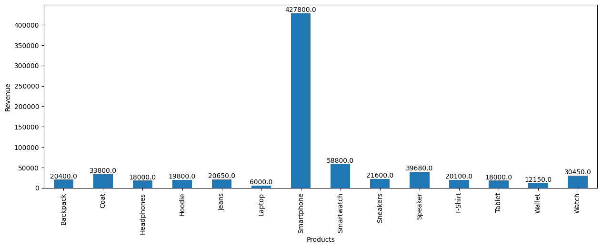
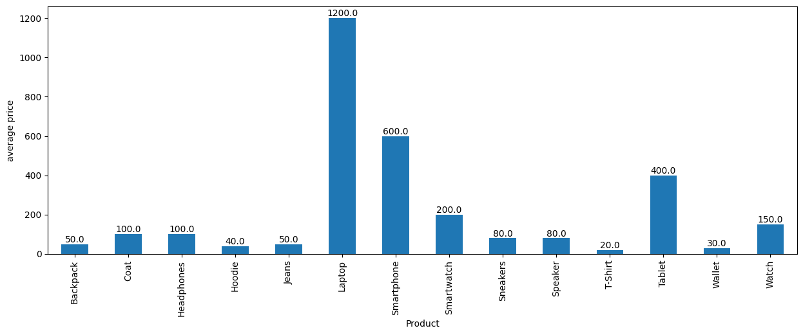
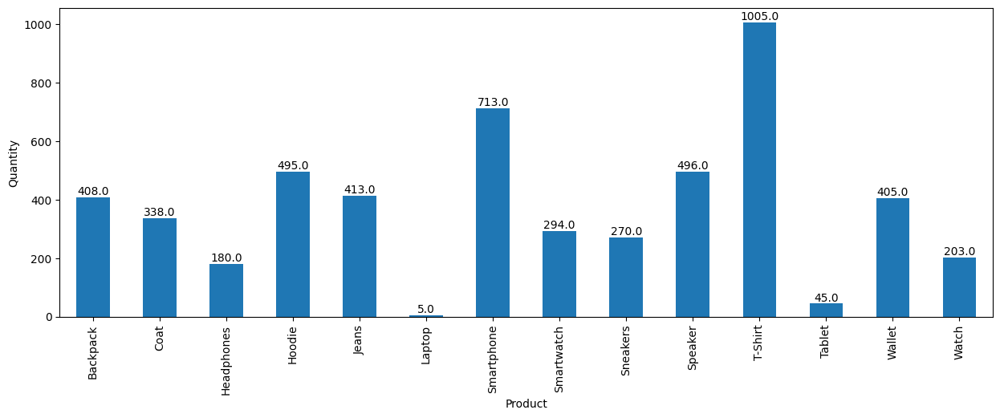
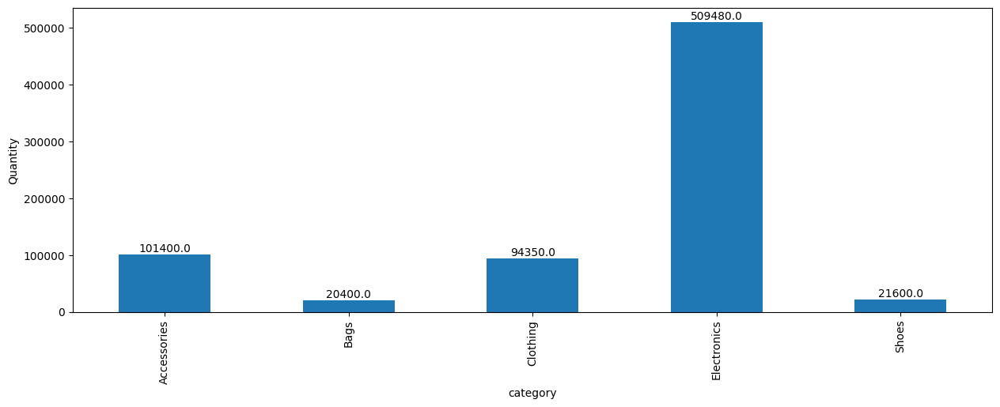

# Sales Data Analysis

An assessment prepared by Intern2Grow, for its Data Analyst Virtual Internship Program.
## Questions:
1. What was the total revenue generated by the company over the course of the year?
    - 747230.0

2. Which product had the highest revenue? How much revenue did it generate?
    - smartphones, 427,800
    

3. What was the average price of a product sold by the company?
    

4. What was the total quantity of products sold by the company?
    

5. Which category had the highest revenue? How much revenue did it generate?
    - Electronics
    

6. What was the average revenue per sale?
    - Average revenue per sale: 141.79
      
7. What was the total revenue generated in each quarter of the year? (i.e. Q1, Q2, Q3, Q4)
    - Quarter 2022Q1: Total Revenue $182100.00
    - Quarter 2022Q2: Total Revenue $177370.00
    - Quarter 2022Q3: Total Revenue $195430.00
    - Quarter 2022Q4: Total Revenue $192330.00
